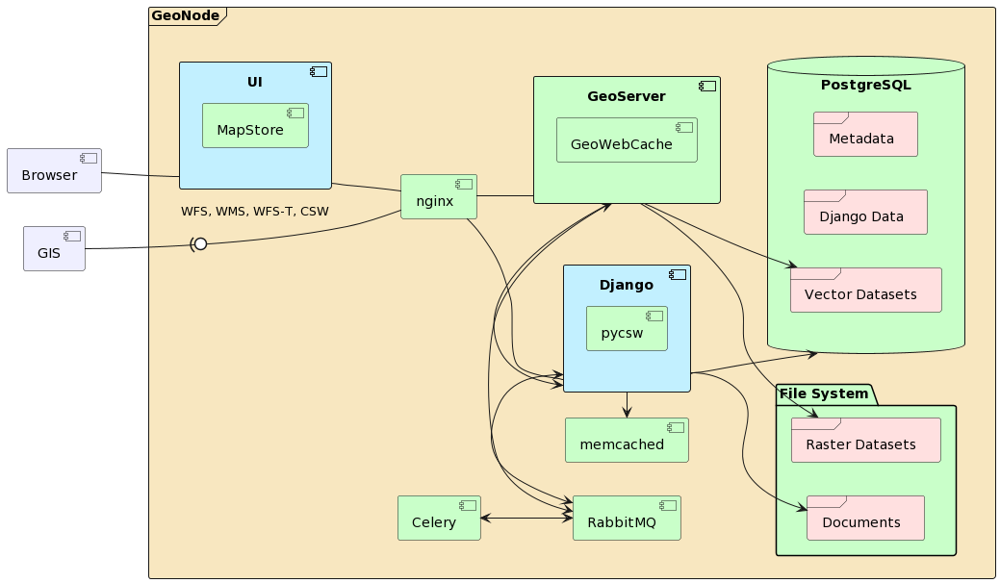

# Geonode Installation

This document will guide you through the installation of [GeoNode](https://geonode.org/) a spatial content management system.
The needed components are available as [Docker](https://www.docker.com/) images and will be setup and run via the [docker-compose](https://docs.docker.com/compose/) tool.

## Component Overview

Here is a short overview of the installed components and how they are connected.



The components are:

**Django:** The actual GeoNode component.
It exposes a [pyCSW API](https://pycsw.org/) and the GeoNode API.

**Celery:** [Celery](https://docs.celeryq.dev/en/stable/) forms the asynchronuous task queue of GeoNode.

**GeoServer:** [GeoServer](https://geoserver.org/) is the backend server of GeoNode for sharing geospatial data.
It exposes OGC APIs such as WMS, WFS, etc. 

**Nginx:** [Nginx](https://nginx.com) serves as advanced load balancer, web server and reverse proxy to all GeoNode components.

**PostgreSQL:** GeoNode and GeoServer are using [PostgreSQL](https://www.postgresql.org)  with the geospatial extension [PostGIS](https://postgis.net) as the database.

## Installation

Make sure you have installed `git`, `Docker` and `docker-compose`.

Clone the [istg_geonode repository]( https://github.com/52North/istg_geonode) and change directory your local working copy:

```
git clone https://github.com/52North/istg_geonode geonode
cd geonode
```

## Configuration

Configuration is done in the `.env`-file and in the `geonode/settings.py` module.
The `geonode/settings.py` modulewill be made available as [Docker volume](https://docs.docker.com/storage/volumes/#use-a-volume-with-docker-compose).
The `env`-file exposes settings as environment variables for each container. 


Have a look at the [Ways to set environment variables in Compose](https://docs.docker.com/compose/environment-variables/set-environment-variables/) documentation.

> :bulb: **Note**
>
> Shared settings (e.g. geodatabase parameters) are set in the `.env` file. 
> To review in-built default settings of an image, you can run for example `docker run 52north/istg_geoserver env`.
>
> For a complete set of available options take the [GeoNode Settings](https://docs.geonode.org/en/master/basic/settings/index.html#settings) documentation as a reference.

